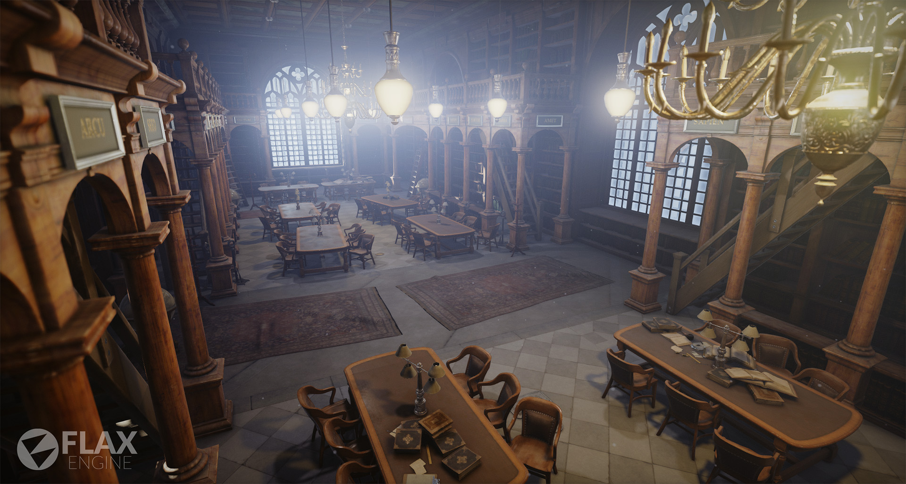
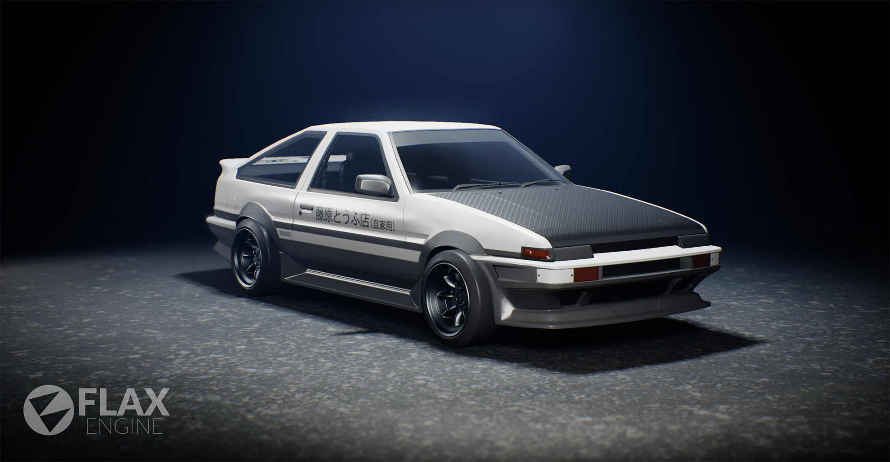

<h1>Flax Engine</h1>

Flax Engine is a high quality modern 3D game engine written in C++ and C#.
From stunning graphics to powerful scripts - Flax can give everything for your games. Designed for fast workflow with many ready to use features waiting for you right now. To learn more see the website ([www.flaxengine.com](https://flaxengine.com)).

This repository contains full source code of the Flax (excluding NDA-protected platforms support). Anyone is welcome to contribute or use the modified source in Flax-based games.

# Development

* [Homepage](https://flaxengine.com)
* [Dev Blog](https://flaxengine.com/blog)
* [Documentation](https://docs.flaxengine.com)
* [Forum](https://forum.flaxengine.com)
* [Roadmap](https://trello.com/b/NQjLXRCP/flax-roadmap)

# Flax plugin for Visual Studio

Flax Visual Studio extension provides better programming workflow, C# scripts debugging functionality and allows to attach to running engine instance to debug C# source. This extension is available to download [here](https://marketplace.visualstudio.com/items?itemName=Flax.FlaxVS).

# Screenshots

# Getting started

Follow the instructions below to compile and run the engine from source.

## Windows

* Install Visual Studio 2015 or newer
* Install Windows 8.1 SDK or newer
* Install Microsoft Visual C++ 2015.3 v140 toolset for desktop (x86, x64)
* Clone repo (with LFS)
* Run **GenerateProjectFiles.bat**
* Open `Flax.sln` and set solution configuration to **Editor.Development** and solution platform to **Win64**
* Compile Flax project (hit F7 key)
* Run Flax (hit F5 key)

## Linux

* Install Visual Studio Code
* Install Mono ([https://www.mono-project.com/download/stable](https://www.mono-project.com/download/stable))
* Install Git with LFS
* Install requried packages: `sudo apt-get install nuget autoconf libtool libogg-dev automake build-essential gettext cmake python curl libtool-bin libx11-dev libpulse-dev libasound2-dev libjack-dev portaudio19-dev`
* Install compiler `sudo apt-get install clang-7 lldb-7 lld-7`
* Clone repo (with LFS)
* Run `sudo bash GenerateProjectFiles.sh`
* Open workspace with Visual Code
* Build and run

## Workspace directory

- **Binaries/** - executable files
  - **Editor/** - Flax Editor binaries
  - **Tools/** - tools binaries
- **Cache/** - local data cache folder used by engine and tools
  - **Intermediate/** - intermediate files and cache for engine build
    - ***ProjectName*/** - per-project build cache data
    - **Deps/** - Flax.Build dependencies building cache
  - **Projects/** - project files location
- **Content/** - assets and binary files used by engine and editor
- **Development/** - engine development files
  - **Scripts/** - utility scripts
- **packages/** - Nuget packages cache location
- **Source/** - source code lcoation
  - **Editor/** - Flax Editor source code
  - **Engine/** - Flax Engine source code
  - **Platforms/** - per-platform sources and dependency files
    - **DotNet/** - C# dependencies
    - **Editor/** - Flax Editor binaries
    - ***PlatformName*/** - per-platform files
      - **Binaries/** - per-platform binaries
        - **Game/** - Flax Game binaries
        - **Mono/** - Mono runtime files and data
        - **ThirdParty/** - prebuild 3rd Party binaries
  - **Shaders/** - shaders source code
  - **ThirdParty/** - 3rd Party source code
  - **Tools/** - development tools source code

# Licensing and Contributions

Using Flax source code is strictly governed by the Flax Engine End User License Agreement. If you don't agree to those terms, as amended from time to time, you are not permitted to access or use Flax Engine.

We welcome any contributions to Flax Engine development through pull requests on GitHub. Most of our active development is in the master branch, so we prefer to take pull requests there (particularly for new features). We try to make sure that all new code adheres to the Flax coding standards. All contributions are governed by the terms of the EULA.
